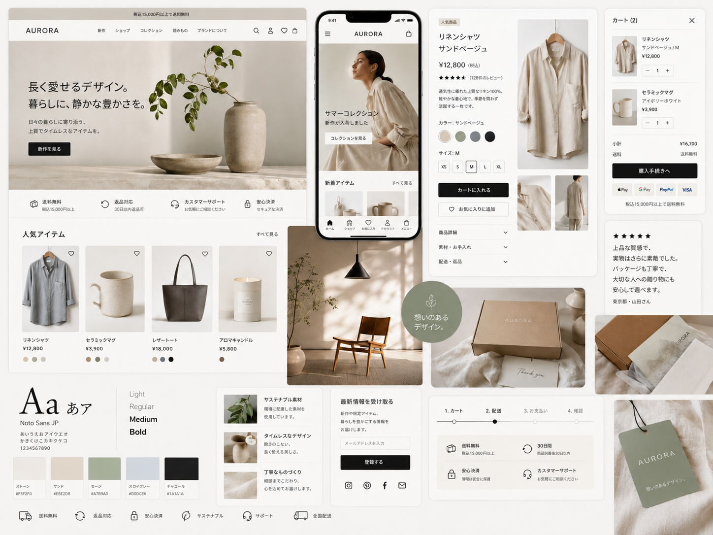

# AURORA — デザイントークン仕様書

ムードボード（[`moodboard.png`](./moodboard.png)・ChatGPT Images 2.0 で生成）から抽出したデザインシステムをまとめたドキュメントです。
実装（`index.html` / `product.html` の Tailwind config・`css/style.css`）はこの仕様に従っています。



---

## 1. ブランドコンセプト

| 項目 | 内容 |
| --- | --- |
| ブランド名 | **AURORA** |
| タグライン | 長く愛せるデザイン。暮らしに、静かな豊かさを。 |
| サブコピー | 日々の暮らしに寄り添う、上質でタイムレスなアイテムを。 |
| トーン | クワイエット・ラグジュアリー × ジャパンディ（北欧×和）ミニマリズム |
| キーワード | 静謐 / 上質 / 自然素材 / サステナブル / 余白 |

---

## 2. カラーパレット

ムードボードに明記された5色をそのままトークン化しています。
彩度を抑えたアースカラーで、強いコントラストは Charcoal のテキスト・ボタンだけで作るのが原則。

| トークン名 | HEX | 役割 |
| --- | --- | --- |
| `stone` | `#F5F2F0` | ベース背景（ストーン＝温かみのあるオフホワイト） |
| `sand` | `#E8E2D8` | カード面・セカンダリ背景（サンド＝ベージュ） |
| `sage` | `#A7B9A0` | ブランドアクセント（セージ＝くすみグリーン／バッジ・タグ） |
| `sky` | `#D0DCE6` | 補助アクセント（スカイグレー＝淡いブルー） |
| `charcoal` | `#1A1A1A` | テキスト・プライマリボタン（チャコール＝ほぼ黒） |

```js
// tailwind.config（CDN 版・各HTMLの <head> に記述）
colors: {
  stone:    "#F5F2F0",
  sand:     "#E8E2D8",
  sage:     "#A7B9A0",
  sky:      "#D0DCE6",
  charcoal: "#1A1A1A",
}
```

> **実装メモ**：Tailwind 標準の `stone` / `sky` スケール（`stone-100` 等）はこの定義で
> 単色に上書きされます。グレー階調が必要なときは `neutral-*` を使うか、
> `charcoal/10` のような不透明度モディファイアで濃淡を表現しています。

---

## 3. タイポグラフィ

| 項目 | 値 |
| --- | --- |
| 書体 | **Noto Sans JP**（Google Fonts・ムードボード指定） |
| ウェイト | 300 Light / 400 Regular / 500 Medium / 700 Bold |

### 使い分け

| 用途 | スタイル |
| --- | --- |
| ロゴ（ワードマーク） | `font-medium` + `letter-spacing: 0.28em`（`.wordmark`） |
| 見出し H1/H2 | `font-light` + `tracking-tight`、サイズで強弱 |
| アイブロウ（小ラベル・英語） | `text-[11px]` + `uppercase` + `letter-spacing: 0.22em`（`.eyebrow`） |
| 本文 | `font-normal`、`text-charcoal/65`、`leading-relaxed` |
| ボタンラベル | `text-[13px]` + `font-medium` + `tracking-[0.15em]` |

ポイントは「**見出しは細く・大きく・字間を詰める**」「**小さいラベルは字間を広げる**」の対比。アイブロウなど装飾的なラベルだけ英語を大文字で使い、意味を伝える文言は日本語にする。

---

## 4. レイアウト & スペーシング

| 項目 | 値 |
| --- | --- |
| コンテナ最大幅 | `1280px`（`max-w-site`） |
| 左右パディング | `px-6`（24px） |
| セクション縦余白 | `py-20`〜`py-28`（80〜112px） |
| 商品カード比率 | `aspect-[4/5]`（縦長） |
| グリッド | 商品一覧 = 4カラム（lg）/ 2カラム（モバイル） |

余白を広く取ることが「高級感」の核。詰め込まない。

---

## 5. 装飾ルール

| 要素 | ルール |
| --- | --- |
| 角丸 | `3px`（`rounded` のデフォルトを上書き）。ほぼ直角で端正 |
| ボーダー | 極細・淡色（`border-charcoal/5`〜`/10`）。区切りは罫線より余白で |
| アイコン | ライン（線）アイコン、`stroke-width: 1.3〜1.5` |
| プライマリボタン | `bg-charcoal text-stone`、塗りつぶし |
| セカンダリボタン | アウトライン（`border-charcoal/20`） |
| 写真 | 自然光・素材感（陶器/リネン/木/植物）が主役。エディトリアル |
| ホバー | 商品画像はゆっくり拡大（`scale(1.045)` / 0.7s） |

---

## 6. コンポーネント一覧

### トップページ（`index.html`）
告知バー → ヘッダー（ロゴ／ナビ／検索・アカウント・カート）→ ヒーロー → 信頼バー(4) → 人気アイテム(4) → ライフスタイル(Sageバッジ) → ブランド価値訴求(3) → レビュー → ニュースレター → フッター

### 商品詳細（`product.html`）
パンくず → 画像ギャラリー（メイン＋サムネ4）→ 商品情報（人気商品バッジ／星評価／カラー・サイズ選択／カートに入れる・お気に入りに追加／安心バー／アコーディオン3）→ 関連商品(4) → ニュースレター → フッター

---

## 7. CSSだけで動くインタラクション（JS不使用）

本デモは「見た目重視の静的実装」のため、状態変化はすべて HTML/CSS のみで実現しています。
教材として参考になるテクニックを `css/style.css` に集約しています。

| 機能 | 仕組み |
| --- | --- |
| モバイルメニュー開閉 | `<input type="checkbox">` + 兄弟セレクタで `translateX` |
| 商品画像ギャラリー切替 | `<input type="radio">` の `:checked` ＋ 一般兄弟セレクタで画像の `opacity` を制御 |
| カラー／サイズ選択 | `radio:checked + label` で選択状態のスタイル付与 |
| アコーディオン | ネイティブの `<details>` / `<summary>`、マーカーを消して chevron を回転 |
| ホバー演出 | `transition` + `transform`、`.link-underline` の下線アニメーション |

---

## 8. 画像クレジット

商品・ライフスタイル写真は [Unsplash](https://unsplash.com/) のフリー素材を使用しています。
（Unsplash License：商用利用可・帰属表示は任意）。出典の一覧は `README.md` を参照。
