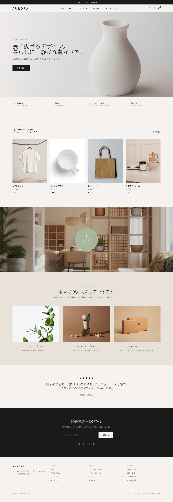
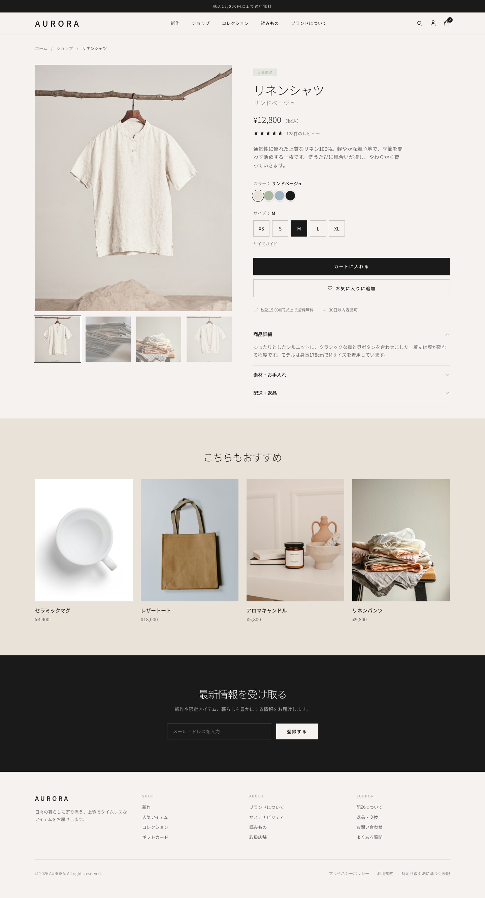
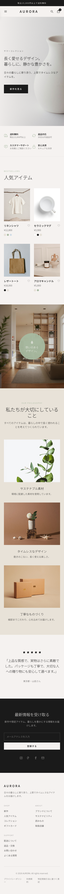

# AURORA — EC デモサイト

ムードボード「AURORA」のデザイントーンを再現した、上質・ミニマルな EC サイトのデモです。
**ビルド不要の静的サイト**（HTML + Tailwind CSS の CDN 版）で構成されており、
ファイルをブラウザで開くだけで動作します。


---

## 🖥️ プレビュー

| トップ（PC） | 商品詳細（PC） | トップ（モバイル） |
| --- | --- | --- |
|  |  |  |

> ヘッドレス Chrome で実レンダリングしたフルページキャプチャ（`screenshots/`）。

---

## ✨ 特徴

- **静的 HTML + Tailwind CSS（CDN）** — ビルドステップなし、依存パッケージなし
- **2 ページ構成** — トップページ（`index.html`）／商品詳細ページ（`product.html`）
- **JavaScript 不使用** — メニュー開閉・画像ギャラリー・カラー/サイズ選択・アコーディオンを
  すべて HTML/CSS のみで実装（教材向け）
- **レスポンシブ** — モバイル〜デスクトップに対応
- Unsplash のフリー写真でリアルな見た目を再現

---

## 📂 ファイル構成

```
demo-ec-site/
├── index.html      # トップページ
├── product.html    # 商品詳細ページ（リネンシャツ）
├── css/
│   └── style.css   # Tailwind で賄えない追加スタイル（CSSだけのインタラクション）
├── images/         # 商品・ライフスタイル写真（Unsplash）
├── screenshots/    # 完成イメージのキャプチャ（PC／モバイル）
├── moodboard.png   # 制作の起点にしたムードボード（ChatGPT Images 2.0で生成）
├── requirements.md # 目的・見る人・トーン・制約（本文2-4節）
├── DESIGN.md       # デザイントークン仕様書
├── CLAUDE.md       # Claude Code が自動で読む制作ルール（本文2-5節）
├── .claude/
│   └── skills/     # design-check / add-product の Skills（本文2-6節）
└── README.md       # このファイル
```

---

## 🚀 開き方

特別なサーバーは不要です。次のいずれかで開けます。

**そのまま開く**

```
open index.html        # macOS
```

**ローカルサーバーで開く（推奨：相対パスが安定）**

```
# Python が入っていれば
python3 -m http.server 8000
# → ブラウザで http://localhost:8000 を開く
```

> Tailwind と Noto Sans JP フォントは CDN から読み込むため、初回表示時のみネット接続が必要です。
> 画像は `images/` にローカル保存しているため、オフラインでも表示されます。

---

## 🎨 デザイントークン（抜粋）

| トークン | HEX | 役割 |
| --- | --- | --- |
| `stone` | `#F5F2F0` | ベース背景 |
| `sand` | `#E8E2D8` | カード面 |
| `sage` | `#A7B9A0` | アクセント |
| `sky` | `#D0DCE6` | 補助アクセント |
| `charcoal` | `#1A1A1A` | テキスト・ボタン |

書体はムードボードの指定どおり **Noto Sans JP**（Google Fonts）を使用。
詳細は [`DESIGN.md`](./DESIGN.md) を参照してください。

---

## 🖼️ 画像クレジット

商品・ライフスタイル写真は [Unsplash](https://unsplash.com/) のフリー素材を使用しています
（Unsplash License：商用利用可・改変可・帰属表示は任意）。

<!-- IMAGE_CREDITS -->
| ファイル | 撮影者 | 出典（Unsplash） |
| --- | --- | --- |
| `hero.jpg` | Sixteen Miles Out | [photo](https://unsplash.com/photos/a-white-vase-sitting-on-top-of-a-white-table-aFvxASlms2A) |
| `product-main.jpg` | tian dayong | [photo](https://unsplash.com/photos/a-white-shirt-hanging-on-a-clothes-line-S4f4apZd-hA) |
| `product-2.jpg` | Joyce Romero | [photo](https://unsplash.com/photos/tC-TOGGEODI) |
| `product-3.jpg` | Svitlana | [photo](https://unsplash.com/photos/HbiRi1Owk9k) |
| `product-4.jpg` | tian dayong | [photo](https://unsplash.com/photos/a-white-shirt-hanging-on-a-clothes-line-lziP7ZPtghg) |
| `mug.jpg` | Mockup Graphics | [photo](https://unsplash.com/photos/white-ceramic-mug-on-white-surface-AJsdrXaRhHk) |
| `tote.jpg` | Kelly Sikkema | [photo](https://unsplash.com/photos/1Pgq9ZpIatI) |
| `candle.jpg` | Mathilde Langevin | [photo](https://unsplash.com/photos/7MRoqWpzqdA) |
| `lifestyle-interior.jpg` | Puscas Adryan | [photo](https://unsplash.com/photos/modern-living-room-with-natural-light-and-wooden-accents-2cfj0Y5ch00) |
| `feature-materials.jpg` | Annie Spratt | [photo](https://unsplash.com/photos/hX_hf2lPpUU) |
| `feature-design.jpg` | Maria Lupan | [photo](https://unsplash.com/photos/a-single-white-flower-in-a-vase-with-seashells-0IFvTeguMJs) |
| `feature-packaging.jpg` | Mildlee | [photo](https://unsplash.com/photos/brown-cardboard-box-on-white-table-fMveBTz2qWw) |

---

## 📝 ライセンス

本デモのコードはサンプル目的で自由に利用できます。画像は各 Unsplash ライセンスに従います。
